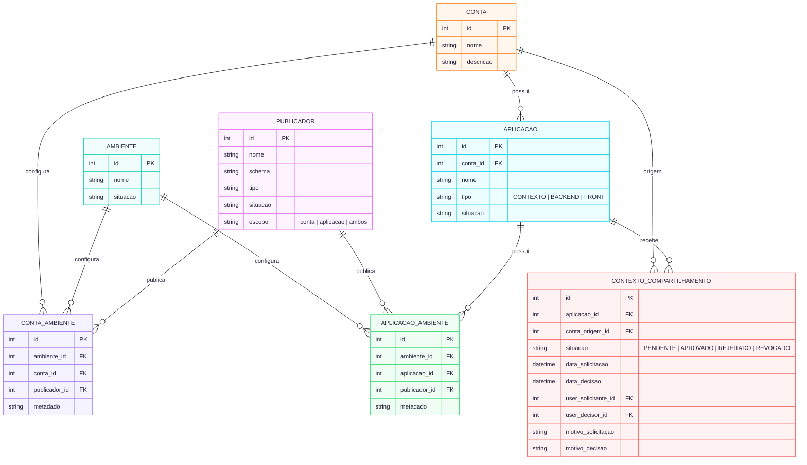
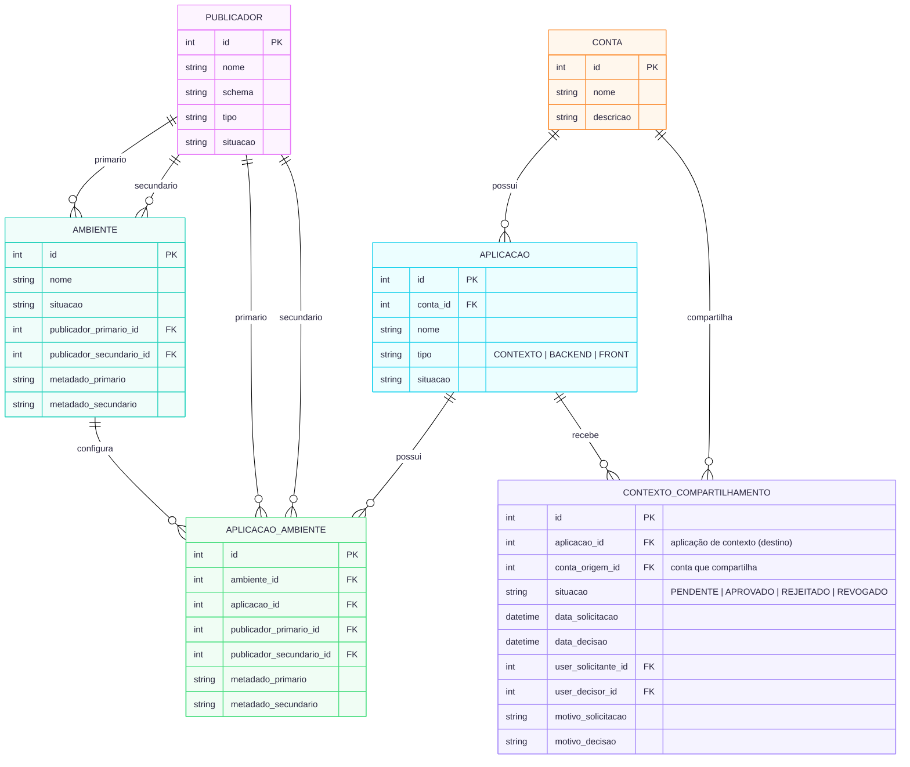

# Publicadores por Conta  

```mermaid
---
config:
  layout: dagre
  theme: redux-color
---
erDiagram

    PUBLICADOR {
        int id PK
        string nome
        string schema
        string tipo
        string situacao
        string escopo  "conta | aplicacao | ambos"
    }

    AMBIENTE {
        int id PK
        string nome
        string situacao
    }

    CONTA {
        int id PK
        string nome
        string descricao
    }

    APLICACAO {
        int id PK
        int conta_id FK
        string nome
        string tipo  "CONTEXTO | BACKEND | FRONT"
        string situacao
    }

    APLICACAO_AMBIENTE {
        int id PK
        int ambiente_id FK
        int aplicacao_id FK
        int publicador_id FK
        string metadado
    }

    CONTA_AMBIENTE {
        int id PK
        int ambiente_id FK
        int conta_id FK
        int publicador_id FK
        string metadado
    }

    CONTEXTO_COMPARTILHAMENTO {
        int id PK
        int aplicacao_id FK
        int conta_origem_id FK
        string situacao  "PENDENTE | APROVADO | REJEITADO | REVOGADO"
        datetime data_solicitacao
        datetime data_decisao
        int user_solicitante_id FK
        int user_decisor_id FK
        string motivo_solicitacao
        string motivo_decisao
    }

    CONTA ||--o{ APLICACAO : possui
    CONTA ||--o{ CONTA_AMBIENTE : configura
    CONTA ||--o{ CONTEXTO_COMPARTILHAMENTO : origem

    AMBIENTE ||--o{ APLICACAO_AMBIENTE : configura
    AMBIENTE ||--o{ CONTA_AMBIENTE : configura

    PUBLICADOR ||--o{ APLICACAO_AMBIENTE : publica
    PUBLICADOR ||--o{ CONTA_AMBIENTE : publica

    APLICACAO ||--o{ APLICACAO_AMBIENTE : possui
    APLICACAO ||--o{ CONTEXTO_COMPARTILHAMENTO : recebe

```
   
    #Publicadores por Ambiente  

```mermaid
---
config:
  layout: dagre
  theme: redux-color
---
erDiagram

    PUBLICADOR {
        int id PK
        string nome
        string schema
        string tipo
        string situacao
    }

    AMBIENTE {
        int id PK
        string nome
        string situacao

        int publicador_primario_id FK
        int publicador_secundario_id FK

        string metadado_primario
        string metadado_secundario
    }

    CONTA {
        int id PK
        string nome
        string descricao
    }

    APLICACAO {
        int id PK
        int conta_id FK
        string nome
        string tipo   "CONTEXTO | BACKEND | FRONT"
        string situacao
    }

    APLICACAO_AMBIENTE {
        int id PK
        int ambiente_id FK
        int aplicacao_id FK

        int publicador_primario_id FK
        int publicador_secundario_id FK

        string metadado_primario
        string metadado_secundario
    }

    CONTEXTO_COMPARTILHAMENTO {
        int id PK
        int aplicacao_id FK     "aplicação de contexto (destino)"
        int conta_origem_id FK  "conta que compartilha"

        string situacao          "PENDENTE | APROVADO | REJEITADO | REVOGADO"

        datetime data_solicitacao
        datetime data_decisao

        int user_solicitante_id FK
        int user_decisor_id FK

        string motivo_solicitacao
        string motivo_decisao
    }

    CONTA ||--o{ APLICACAO : possui
    CONTA ||--o{ CONTEXTO_COMPARTILHAMENTO : compartilha

    AMBIENTE ||--o{ APLICACAO_AMBIENTE : configura

    PUBLICADOR ||--o{ AMBIENTE : primario
    PUBLICADOR ||--o{ AMBIENTE : secundario

    PUBLICADOR ||--o{ APLICACAO_AMBIENTE : primario
    PUBLICADOR ||--o{ APLICACAO_AMBIENTE : secundario

    APLICACAO ||--o{ APLICACAO_AMBIENTE : possui
    APLICACAO ||--o{ CONTEXTO_COMPARTILHAMENTO : recebe
```
